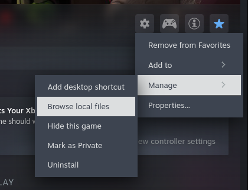
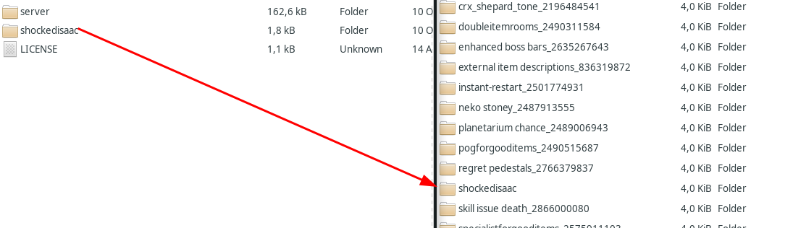
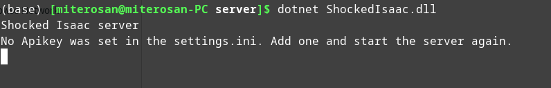
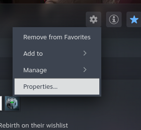
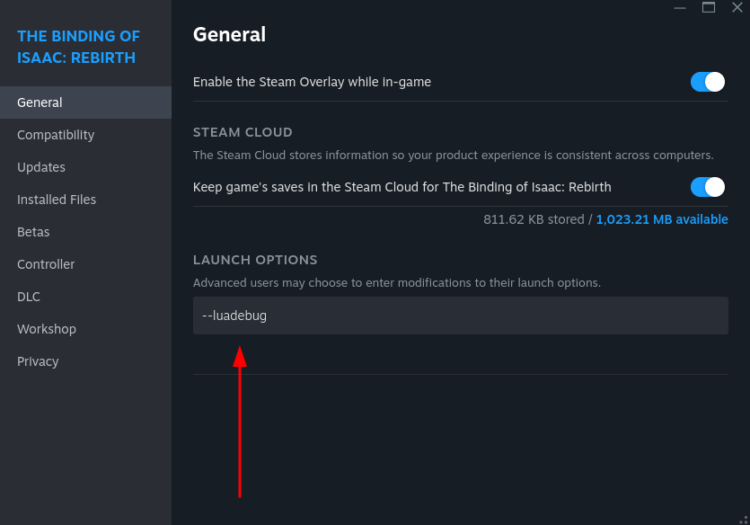

Shocked Isaac mod
----------

OpenShock/Shocklink support for isaac.

Shocks when isaac gets hit or dies

Intentional damage (curse, sacrifice rooms) shock aswell, but shorter with more strength

## Remarks

- The isaac modding API is sandboxed by default. In order to communicate with openshock the sandbox needs to be turned off. See the installation guide.

## Installation
 
This mod works on linux/windows/mac

You need the current version of the [dotnet runtime or sdk](https://dotnet.microsoft.com/en-us/download)

1. Download the latest release from [here](https://github.com/miterosan/ShockedIsaac/releases/download/v1/ShockedIsaac.v1.zip)

2. In steam click on The binding of isaac rebirth and then "browse local files"


3. Copy the shockedisaac folder (from the downloaded zip) to the mods folder


4. Start the server using ```dotnet ShockedIsaac.dll```


5. Change the settings in the ```settings.ini``` file to your likings

6. Start the server again using```dotnet ShockedIsaac.dll```

7. Start the server using ```dotnet run```.

8. Insert the API token genertated from https://openshock.app/#/dashboard/tokens into the server console app.

9. Go to the game settings of Isaac in Steam.


10. Add ```--luadebug``` to the launch options


11. Start Isaac and get shocked!

# Configuration

|Setting|Description|
|-|-|
|ApiKey| API token genertated from https://openshock.app/#/dashboard/tokens|
|HitDuration| Length in ms of the shock on a normal hit|
|HitStrength| Strength 1-100 of the shock on a normal hit|
|IntentionalHitDuration| Length in ms of the shock on a intentional hit (like sacrifice, some spikes, blood bank)|
|IntentionalHitStrength| Strength 1-100 of the shock on a intentional hit (like sacrifice, some spikes, blood bank)|
|HitDuration| Length in ms of the shock on a death|
|DeathStrength| Strength 1-100 of the shock on a death|
|DeathStrength| Strength 1-100 of the shock on a death|
|IntentionalDamageMode| Should an intentional hit result in a shock or virbation. Possible values: Shock or Vibrate|
|Shockers| A list of the names of the shockers separated by ```,```|
